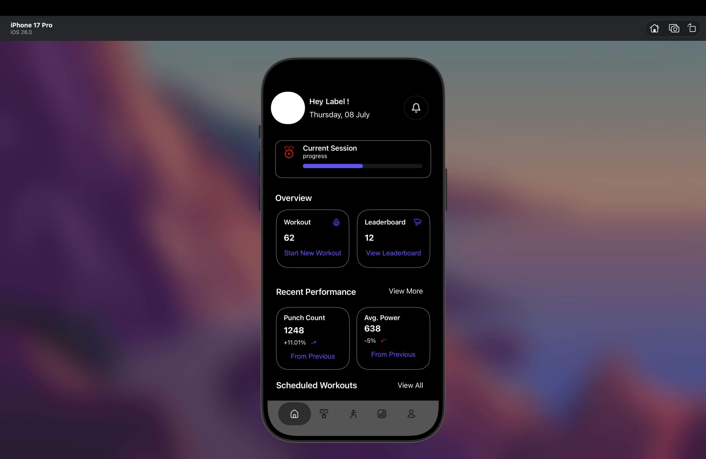
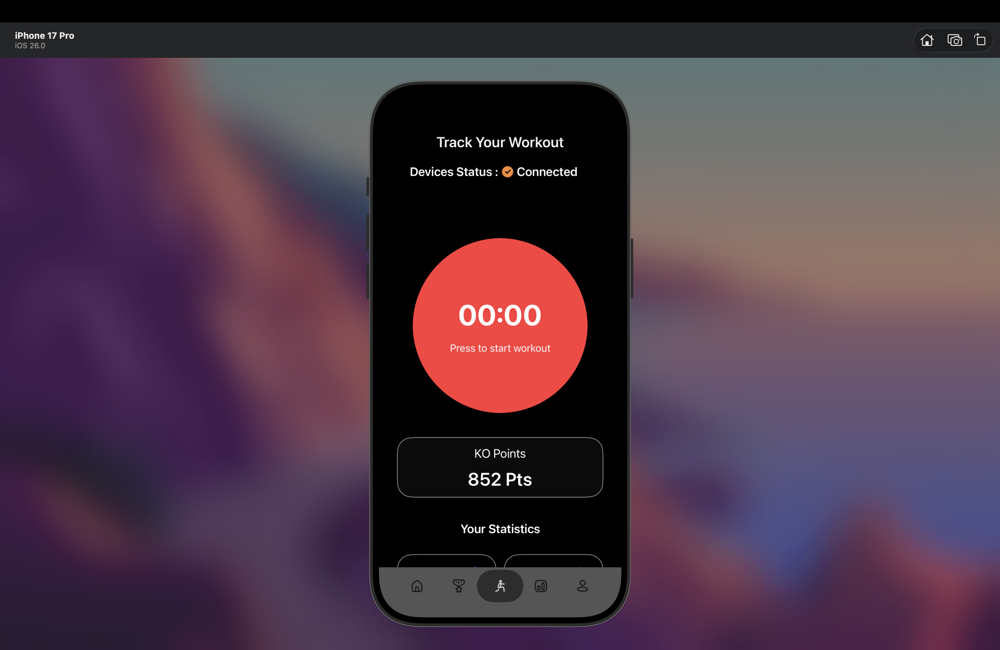
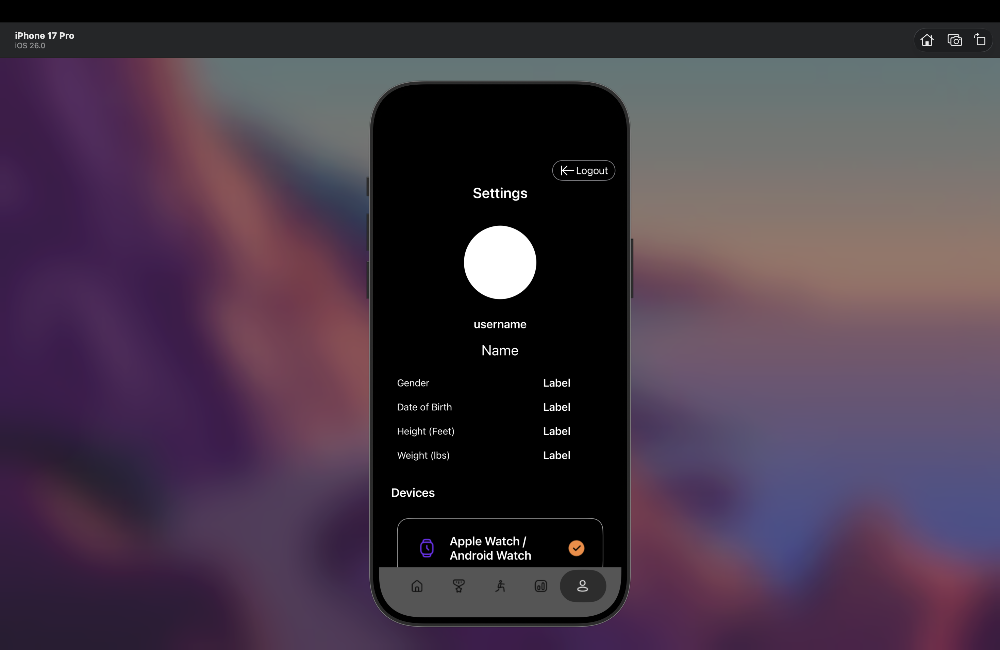

# 💪 FitnessApp

A sleek and interactive **iOS Fitness Tracker App** built with **Swift** and **UIKit**.  
Track workouts, monitor progress, and stay motivated — all in one simple app.

---

## 🧩 Features

- 🏋️ **Workout Tracking:** Add, edit, and view your daily workouts  
- 📊 **Progress Charts:** Visualize your fitness progress over time  
- 🧠 **MVC Architecture:** Clean UI  
- 🧱 **Local Storage:** Save workouts and data locally using UserDefaults  
- 📱 **UIKit-based UI:** Fully responsive with Auto Layout & Storyboards

---

## 🖥️ Screenshots

| Dashboard | Workout Detail | Track Workout | Profile Screen |
|------------|----------------|----------------|----------------|
|  |  |  |  |

> *Screenshots are stored inside the `/screenshots` folder.*

---

## 🛠️ Tech Stack

- **Language:** Swift 5  
- **Framework:** UIKit  
- **Architecture:** MVVM  
- **Storage:** UserDefaults  
- **UI:** Auto Layout & Storyboards  
- **Animations:** Custom transitions (Slide, Fade)  

---

## 🚀 How to Run

1. Clone the repo  
   ```bash
   git clone https://github.com/rohit0007ch/FitnessApp.git
   cd FitnessApp
   open FitnessApp.xcodeproj


## 🧑‍💻 Author

**Rohit** — iOS Developer  
📧 rc11102003@gmail.com  
🌐 [Portfolio Website](https://rohit0007ch.github.io)

